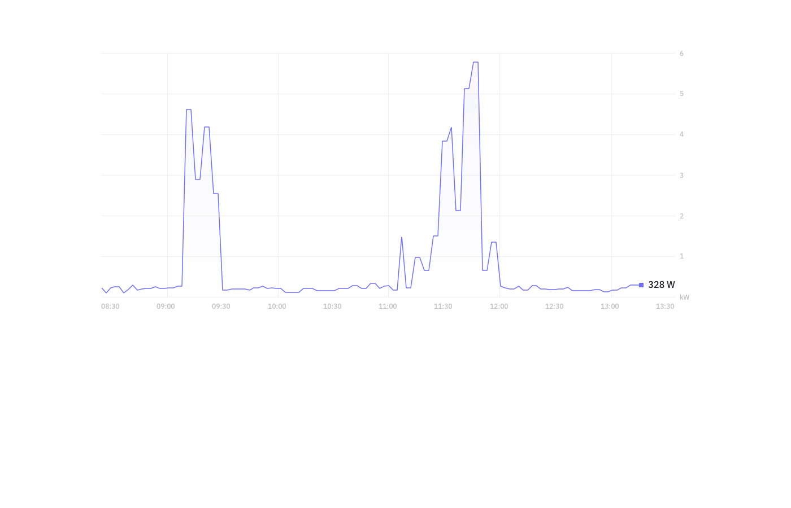

# Candidate coding challenge

We appreciate your interest in Fresh Energy, and we want to thank you for taking your time to carry out our coding challenge. All submissions will be reviewed carefully.

## The problem

At Fresh Energy, smart meter data is at the core of what we do. We want to see what you can do with it.

The challenge is to read from a stream of simulated smart meter data, display the meter's consumption in real time, respond correctly to control messages in the stream, and display the meter data on a web page. We will provide you with a single `.jar` file that produces the data stream. You can use whatever technologies you feel comfortable with, but we would encourage you to match our [stack](https://stackshare.io/fresh-energy-gmbh/fresh-energy). We use [React](https://reactjs.org/) on the frontend, and [Spring Boot](https://spring.io/projects/spring-boot) for the backend. Your submission should be easy to run in a cloud environment like [AWS](https://aws.amazon.com/).

## Frontend presentation
Here's a concept wireframe for how your frontend may look, to give you some inspiration:



## Data stream format

Our `.jar` will produce a stream of JSON messages in TCP packets. This stream will include data for several smart meters, including consumption data and status messages on the health of the smart meters. Each message will be sent as a singl line ending with LF. It is also expected that control messages sent by client ending with LF. You will find the `.jar` file in the root of this repo with the name `readings-server.jar`.

You can run the application with `java -jar readings-server.jar <port> <meters-count>`

For example, to run on port 10001, transmitting data for 5 meters, run `java -jar readings-server.jar 10001 5`.

Note: the ports betwean 9000..(9000 + number_of_meters) will be used for receiving controll messages, make sure that those ports are free for usage.

### Readings messages

Will be of the format:

```json
{
  "type" : "READINGS",
  "payload" : {
    "meterId": "testMeter1",
    "timestamp": 1548687561760,
    "data": {
      "energy": 1234,
      "power": 1300,
      "voltage": 230.19,
      "frequency": 50.023
    }
  }
}
```

The `timestamp` field is represented as a unix timestamp, including milliseconds. The `energy`, `power`, `voltage` and `frequency` fields will all vary from time to time. As mentioned, we will send messages for several smart meters. Your frontend application should display a graph of `power` values over time, and the sum of `energy` values received.

### Control messages:

Will be of the format:
 
```json
{
  "type": "CONTROL",
  "payload" : {
    "meterId": "1",
    "port": "23456"
  }
}
```

When a control message arrives, your client application should calculate the sum of `energy` values received for that meter, and respond to the message on the port mentioned in the control message. The server sends one control message per meter and it wait to receive a response for that meter before sending a new control message for that meter. Example: if you got a control message for `meterId`: "1", you'll not receive a new control message for that meter until you send a response back for this meter.

The response message will be of the format:

```json
{
  "type": "SUM_CONTROL",
  "payload" : {
    "meterId": "1",
    "sum": 23456
  }
}
```

To check if your result is correct there are two options: 

* you can consume back the message sent by the server, that would be in the following format: 

```json
{"expected":24030, "received": 20838 }
```
* or just go to where you're runnning the `.jar` file and check the logs (it will print the message in the same format as above)

## System overview


## What we're looking for

As we said at the top, we want to see you develop an application using technologies you like, but ideally `React` and `Spring Boot`. Aside from that, you have a lot of freedom. Choose an approach that challenges you to come up with an elegant solution.

We will examine your submission looking for:
 * A clean solution that meets the requirements
 * Clear documentation on how to run it
 * Adequate test coverage (we'll stress test it)
 * Useful logging
 * Reliable security
 * Your own personal flair
 * Security aspects

## How to submit

Your recruitment contact will provide you with an email address to which you should send your completed submission. This should be in the form of a zipped folder, containing all resources necessary to run the project, documentation, and anything else you need to include.
