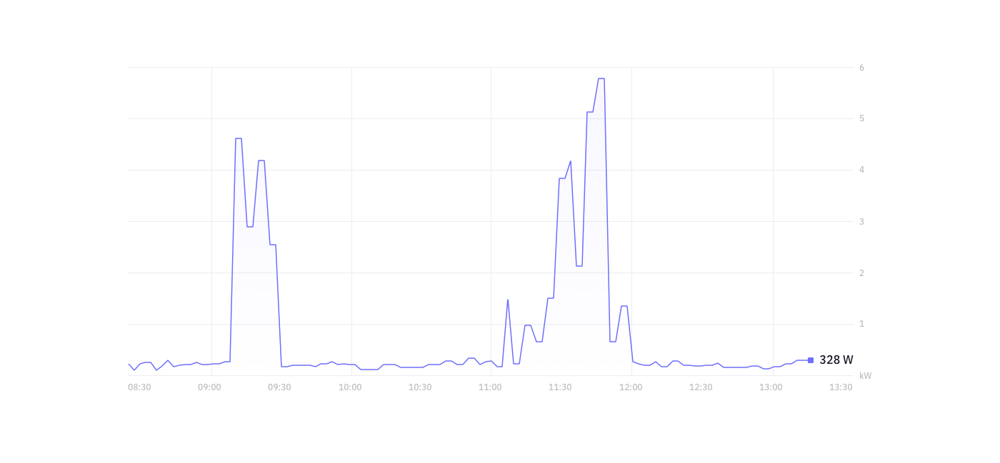

# Candidate coding challenge

We appreciate your interest in Fresh Energy, and we want to thank you for taking your time to carry out our coding challenge. All submissions will be reviewed carefully.

## The problem

At Fresh Energy, smart meter data is at the core of what we do. We want to see what you can do with it.

The challenge is to read from a stream of smart meter data, and display the meter's consumption in real time, on a web page. We will provide you with a single `.jar` file that produces the data stream. We want to see you use [React](https://reactjs.org/) on the frontend, and [Spring Boot](https://spring.io/projects/spring-boot) for the backend. Your submission should be easy to run in a cloud environment like [AWS](https://aws.amazon.com/).

## Frontend presentation
Here's a concept wireframe for how your frontend may look, to give you some inspiration:




## Data stream format

Our `.jar` will produce a stream of JSON messages in TCP packets. This stream will include data for several smart meters, including consumption data and status messages on the health of the smart meters.

### Consumption messages

Will be of the format:

```json
{
  "meterId": "testMeter1",
  "timestamp": "1548687561760",
  "data": {
    "power": "1300W",
    "voltage": "230.19V",
    "frequency": "50.023Hz"
  }
}
```

The `timestamp` field is represented as a unix timestamp, including milliseconds. The `power`, `voltage` and `frequency` fields will all vary from time to time. As mentioned, we will send messages for several smart meters.


### Status messages:

Will be of the format:
 
```json
{
  "meterId": "testMeter2",
  "timestamp": "1548687727341",
  "status": {
    "transmission_quality": "good",
    "internet_connectivity": "good",
    "system_uptime": "250 days",
    "messages_sent": 64739
  }
}
```

Status messages might also contain additional fields that arrive unexpectedly.

## What we're looking for

As we said at the top, we want to see you develop an application using `React` and `Spring Boot`. Aside from that, you have a lot of freedom. Feel free to choose technologies you enjoy or feel comfortable with. Choose an approach that challenges you to come up with an elegant solution.

We will examine your submission looking for:
 * A clean solution that meets the requirements
 * Clear documentation on how to run it
 * Adequate test coverage
 * Useful logging
 * Reliable security
 * Your own personal flair

## How to submit

Your recruitment contact will provide you with an email address to which you should send your completed submission. This should be in the form of a zipped folder, containing all resources necessary to run the project, documentation, and anything else you need to include.
